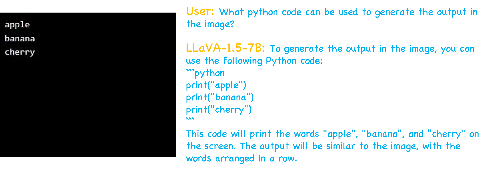
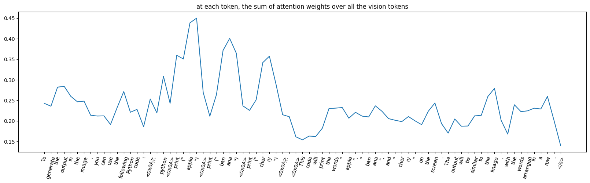
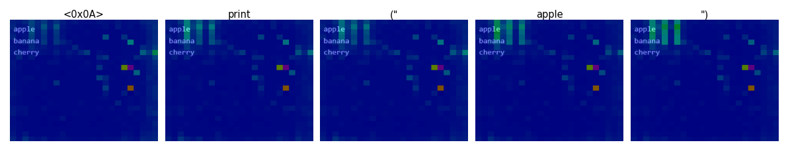

# Visualizing the attention of vision-language models
## About
- Just like how CNNs, ViTs, LLMs themselves have tools for visualizing/interpreting their decision process, I would like to have a tool to visualize how vision-language models (or multi-modal LLMs) generate their responses based on the input image. Specifically I try to see **what parts of the image the model is looking at when generating a certain token**. The idea is straightforward: we can combine the attention weights of the LLM with the attention weights of the ViT to produce an attention map over the input image.

- *Note* that this project is a work in progress and many design choices are open to debate. It may not be the most rigorous implementation. Also, it currently only supports [LLaVA](https://github.com/haotian-liu/LLaVA) models (specifically the v1.5 versions; v1.6 and the latest Next series need extra adaptations). I can definitely consider extending it to other models if there is interest. *If you have any ideas or thoughts, feel free to open a discussion [here](https://github.com/zjysteven/VLMVisualizer/discussions)*.

- Browse the example jupyter notebook [llava_example.ipynb](llava_example.ipynb) to try yourself.

## Examples
This is kind of a naive example but can serve as a proof of concept. The image is an input from [MMBench](https://github.com/open-compass/MMBench/blob/main/samples/MMBench/1.jpg).

With the steps in [llava_example.ipynb](llava_example.ipynb), we can first see how much attention the model pays to the image when generating each token.

For example, when generating the `apple` token in `print("apple")`, around 45% of the attention is on the vision tokens, which makes sense as the model needs to read "apple" from the image. It also makes sense that compared to other tokens, the model pays more attention to vision tokens when generating the three words (apple, banana, cherry; see the three peaks in the above plot).

Then we can further connect with the vision encoder, i.e. using ViT's attention, to show the attention map over the input image.

The figure shows the image overlayed with the attention map when generating those tokens. Although there seems to be some random areas that the model pays attention to all the time, we can see that when generating `apple`/`banana`/`cherry` the model does seem to focus more on the "apple"/"banana"/"cherry" in the image.

## Installation
Install a compatible version of torch and torchvision. Then install dependencies with `pip install -r requirements.txt`.

## Acknowledgements
[LLaVA](https://github.com/haotian-liu/LLaVA): The official implementation of the LLaVA model.

[attention](https://github.com/mattneary/attention): Attention aggregation for LLMs is heavily borrowed from this repo.

## Related projects
[lmms-finetune](https://github.com/zjysteven/lmms-finetune): A unified and simple codebase for finetuning large vision language models including LLaVA-1.5/1.6/NeXT-Interleave/NeXT-Video/OneVision, Qwen(-2)-VL, Phi3-V.
